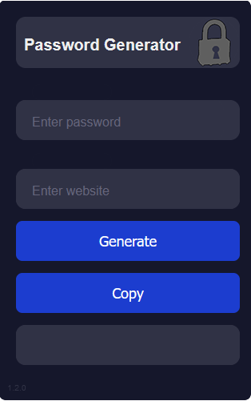

# Password Browser Entension
A browser extension for an automatic password generator

## About

This extension came about as an individual summer project to learn and develop JS, CSS, and HTML skills. What started as a bit of python code, slowly transformed into a simple and usable browser extension for creating and managing unique passwords across multiple sites.

Here's why:
* Many people that use online services often select simple and easy to remember passwords for their log in information
* Additionally, the same password is often used across multiple applications and websites
* This can become devastating should any one site or application suffer a data breach as, amongst other personal information, password information maybe stolen.

The purpose of this application is to allow users to create unique log-ins using applicable ascii characters based upon the website and a simpler password (one a user might typically select for a password).

(<a href="#readme-top">back to top</a>)

### Installation
1. Download or Clone the repo

2. Open extension manager and enable _Developer mode_

3. Select _Load upacked_ and locate and select the project directory file

4. Extension should run directly from browser

Runs on any of the following browsers

   

(<a href="#readme-top">back to top</a>)

